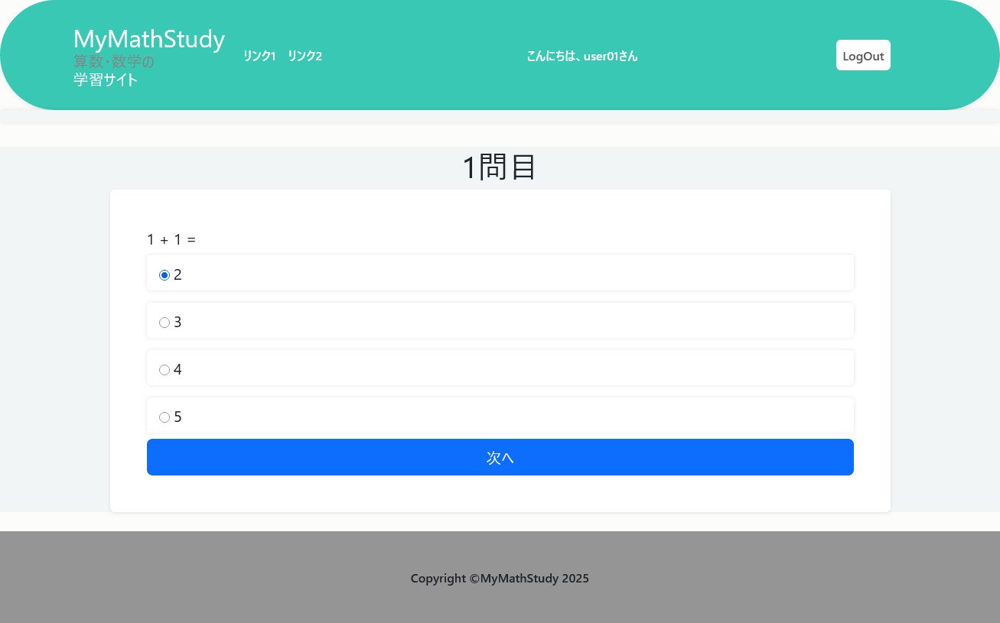

# 簡易試験アプリ

## 使用技術

- Python 3.13 以降
- Django 5.2
- Bootstrap 5
- PostgreSQL（開発時）
- SQLite（このリポジトリ）
- django-environ

## 概要

簡単な試験が実施できる Django アプリです。

1つの試験を、1問から最大10問までを1つとして作成し、試験を実施できます。

- 以下のような流れになります。

  - 1問目
  - 1問目回答(正解 不正解を表示)
  - 2問目
  - 2問目回答(正解 不正解を表示)
  - ...
  - 最終問題回答
  - 点数と正誤表を発表(点数は1問10点で計算)

ユーザー認証機能がありますが、`session` を使い**未ログインでも試験**ができるようになっています。

- 実際の試験は、スーパーユーザーを作成し管理サイトに入って以下のような手順で試験が作成できます。

  - CategoriesからCATEGORYを追加
  - ExamsからEXAMの追加
  - QuestionsからQUESTIONの追加で問題を作成、10問まで作成可能
  
## スクリーンショット

### 試験画面




## データベースについて

開発は PostgreSQL でおこないましたが、このリポジトリでは SQLite を使用しています。
  
また、環境変数の管理に `django-environ` を導入しているので `.env` を設定していただければ PostgreSQL でも実行できるようになっています。
  
`.env.example` を参考に `.env` を設定してください。そのままでしたら SQLite で実行できます。
  

## 導入方法

  
```bash  
git clone https://github.com/rotyo-ko/djangomath
# git がないときは zipファイルをダウンロードしてください。

cd djangomath

# .env の作成
# .env.example をコピーして .env を作成してください

# 仮想環境の作成
python -m venv venv
```

## 仮想環境の有効化
### Windows (コマンドプロンプト)
```bash
venv\Scripts\activate
```

### Windows PowerShell
```bash
.\venv\Scripts\Activate.ps1
```
### macOS / Linux (bash/zsh)
```bash
source venv/bin/activate
```

## パッケージのインストール
```bash
pip install -r requirements.txt
```
## SECRET_KEY の設定

Django を起動するには SECRET_KEY が必要です。

以下のコマンドを実行して、表示された文字列を `.env` の `SECRET_KEY` に設定してください。


```bash
python -c "from django.core.management.utils import get_random_secret_key; print(get_random_secret_key())" 
```

## マイグレーション と　サーバー起動
```bash
python manage.py migrate
python manage.py runserver
```
  
### ブラウザでアクセス
http://127.0.0.1:8000/
  
## テストの実行

```bash
python manage.py test
```

## 試験の作成
  ### スーパーユーザーの作成
  ```bash
  python manage.py createsuperuser
  ユーザー名: admin
  メールアドレス: admin@example.com
  Password:<パスワード>
  Password(again):<パスワード>
  ```

  ### 管理サイトにアクセス

  http://127.0.0.1:8000/admin/

  - MYMATH の Categories の追加をクリック、Nameを書き、学年区分を選択し保存
  - Exams の追加をクリック、テスト名を書き、Category を選択し保存
  - Questions の追加をクリック、問題を追加し保存、問題番号は１から順につけてください。問題の正解番号、解説もここに書いてください
  - トップページにテスト名が表示され、クリックするとテストが始まります。
